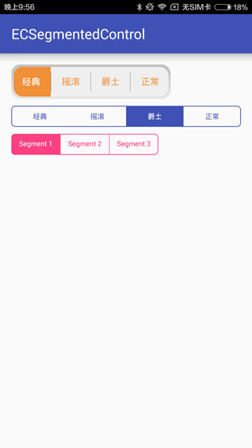
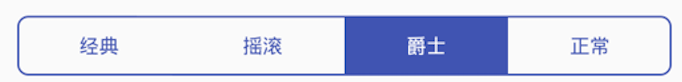
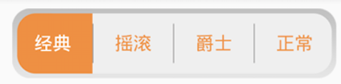
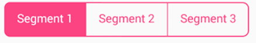

## Overview

iOS的UISegmentedContorl控件在Android上的实现

## Screenshot


## Installation

```
dependencies {
    compile 'com.eleven.lib:ecsegmentedcontrol:+'
}
```

## Usage

###默认样式：



```
<com.eleven.lib.library.ECSegmentedControl
    android:id="@+id/segmentedControl2"
    android:layout_marginTop="10dp"
    android:layout_width="match_parent"
    android:layout_height="wrap_content"
    xmlns:app="http://schemas.android.com/apk/res-auto"
    app:segmentedTexts="@array/segmentedTexts"/>
```

```
<array name="segmentedTexts">
    <item>经典</item>
    <item>摇滚</item>
    <item>爵士</item>
    <item>正常</item>
</array>
```

默认使用colorPrimary颜色。

### 自定义图片背景



```
<com.eleven.lib.library.ECSegmentedControl
    android:id="@+id/segmentedControl"
    android:layout_width="wrap_content"
    android:layout_height="wrap_content"
    xmlns:app="http://schemas.android.com/apk/res-auto"
    app:textSize="13sp"
    app:segmentedBackground="@mipmap/ic_segmentedcontrol_bg"
    app:segmentedForeground="@mipmap/ic_segmentedcontrol_fg"
    app:textColor="@color/selector_sct1"
    app:segmentedTexts="@array/segmentedTexts"
    app:segmentedEnableDivider="true"
    app:segmentedDivider="@mipmap/ic_divider"/>
```

### 自定义颜色



```
<com.eleven.lib.library.ECSegmentedControl
    android:layout_marginTop="10dp"
    android:layout_width="wrap_content"
    android:layout_height="wrap_content"
    xmlns:app="http://schemas.android.com/apk/res-auto"
    app:segmentedEnableDivider="true"
    app:textColor="@color/selector_sct2"
    app:segmentedDivider="@drawable/selector_segmented_divider"
    app:segmentedBackground="@drawable/selector_segmented_bg"
    app:segmentedForeground="@drawable/selector_segmented_fg"/>
```

selector_segmented_bg:

```
<?xml version="1.0" encoding="utf-8"?>
<shape xmlns:android="http://schemas.android.com/apk/res/android" android:shape="rectangle">
    <stroke android:color="@color/colorAccent" android:width="3px"/>
    <corners android:radius="5dp"/>
</shape>

```
selector_segmented_fg:

```
<?xml version="1.0" encoding="utf-8"?>
<shape xmlns:android="http://schemas.android.com/apk/res/android" android:shape="rectangle">
    <solid android:color="@color/colorAccent"/>
    <corners android:radius="5dp"/>
</shape>
```
selector_segmented_divider:

```
<?xml version="1.0" encoding="utf-8"?>
<shape xmlns:android="http://schemas.android.com/apk/res/android" android:shape="rectangle">
    <solid android:color="@color/colorAccent"/>
    <size android:width="3px"/>
</shape>
```


### 事件监听

```
mSegmentedControl.setECSegmentedControlListener(new ECSegmentedControl.ECSegmentedControlListener() {
    @Override
    public void onSelectIndex(int index) {
        Log.d(TAG, "select index " + index);
    }
});
```

选择选中的index

```
mSegmentedControl2.setSelectedIndex(2);
```

## Attributes

```
<attr name="segmentedBackground" format="reference"/>
<attr name="segmentedForeground" format="reference"/>
<attr name="segmentedDivider" format="reference"/>
<attr name="textSize" format="dimension"/>
<attr name="textColor" format="color"/>
<attr name="segmentedTexts" format="reference"/>
<attr name="segmentedEnableDivider" format="boolean"/>
```

## Author

Eleven Chen, skyhacker@126.com

## License

ECSegmentedControl is available under the MIT license. See the LICENSE file for more info.